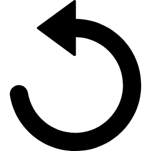

## yank.nvim
ぼくだよ

	

	

	<button class="quote-reload" onclick="updateQuote()"></button>

<a class="twitter-timeline" data-width="350" data-height="300" data-theme="light" href="https://twitter.com/yanknvim?ref_src=twsrc%5Etfw">Tweets by yanknvim</a> 

